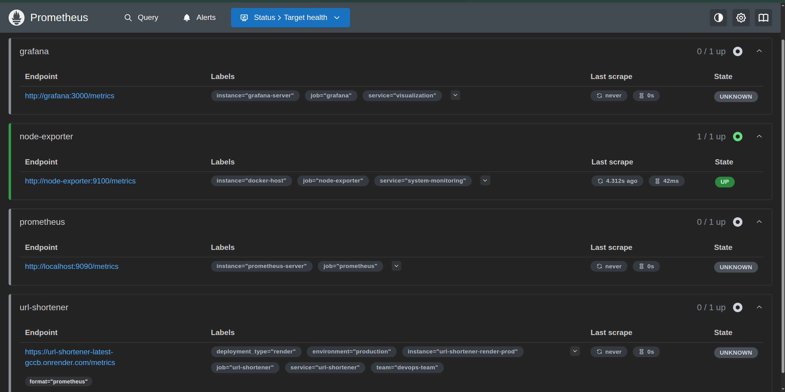
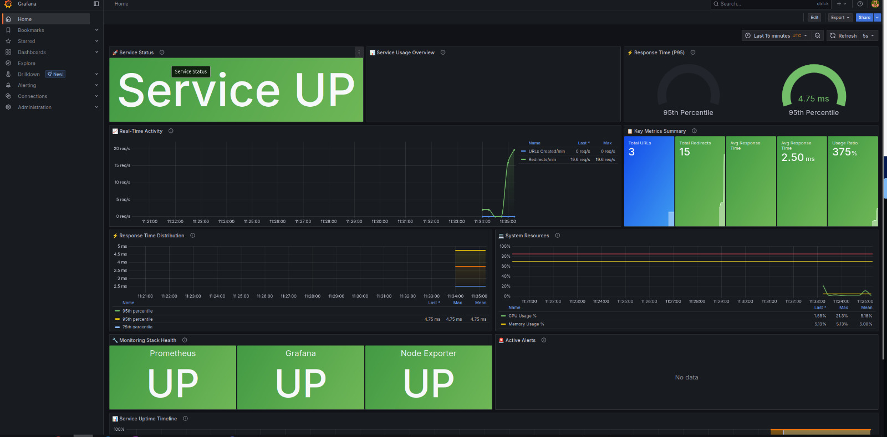
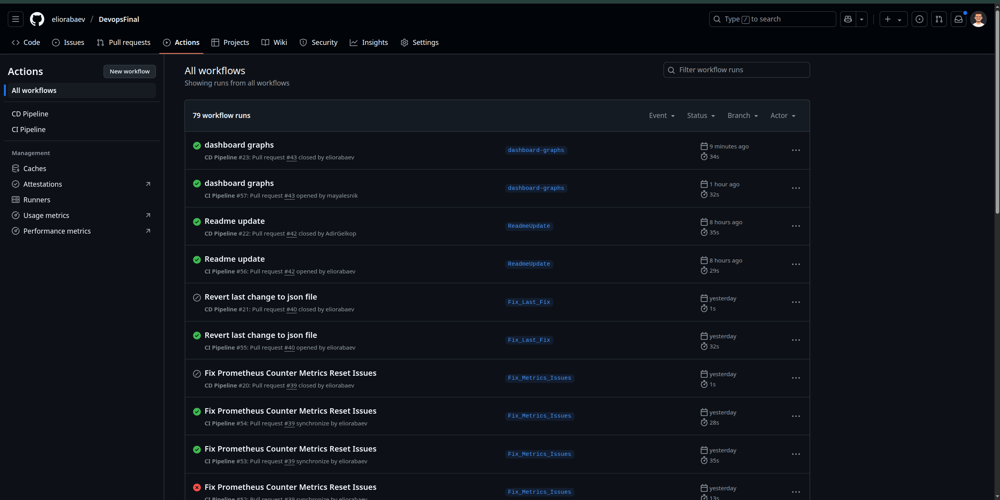
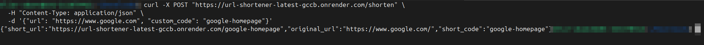

# URL Shortener with Production Monitoring


A production-ready URL shortener service with comprehensive monitoring infrastructure. Built with FastAPI and deployed on Render, featuring real-time metrics collection through Prometheus and visualization via Grafana.

## 🎯 What is this?

This project demonstrates a **fully automated CI/CD pipeline** with a **hybrid cloud architecture** where a URL shortener API runs in production (Render) while monitoring infrastructure operates locally, providing real-time insights into service performance, alerts, and system health.

**Live Service:** [https://url-shortener-latest-gccb.onrender.com](https://url-shortener-latest-gccb.onrender.com)

## 📋 Table of Contents

- [Features](#-features)
- [Architecture](#-architecture)
- [Technologies Used](#-technologies-used)
- [API Endpoints](#-api-endpoints)
- [Monitoring & Metrics](#-monitoring--metrics)
- [Quick Start](#-quick-start)
- [CI/CD Pipeline](#-cicd-pipeline)
- [Sample Screenshots](#-sample-screenshots)
- [Using the Service](#-using-the-service)
- [Development Setup](#-development-setup)
- [Troubleshooting](#-troubleshooting)

## ✨ Features

### Core Functionality
- **URL Shortening**: Create short, memorable URLs from long links
- **Custom Codes**: Use personalized short codes for branded links  
- **Instant Redirects**: Fast 301 redirects to original destinations
- **Real-time Stats**: Track creation and redirect metrics

### Production Infrastructure
- **Cloud Deployment**: Hosted on Render with automatic deployments
- **Monitoring Stack**: Prometheus + Grafana + Node Exporter
- **Alert System**: Proactive notifications for service issues
- **Performance Tracking**: Request duration, success rates, and throughput

### DevOps Features
- **Automated CI/CD**: GitHub Actions with linting, testing, and deployment
- **Docker Containerization**: Consistent environments across development and production
- **Health Checks**: Built-in service monitoring and availability checks
- **Multi-container Setup**: Docker Compose orchestration

## 🏗️ Architecture

```
┌─────────────────┐    ┌──────────────┐    ┌─────────────┐
│   Prometheus    │───▶│ URL Shortener│───▶│   Grafana   │
│  (localhost)    │    │   (Render)   │    │ (localhost) │
└─────────────────┘    └──────────────┘    └─────────────┘
        │                                          │
        ▼                                          ▼
┌─────────────────┐                    ┌─────────────────┐
│  Node Exporter  │                    │   Dashboards    │
│  (localhost)    │                    │   & Alerts      │
└─────────────────┘                    └─────────────────┘
```

### Components

| Component | Location | Purpose | Technology |
|-----------|----------|---------|------------|
| **URL Shortener API** | Render Cloud | Core service handling URL creation and redirects | FastAPI, Python |
| **Prometheus** | Local Docker | Metrics collection and storage | Prometheus |
| **Grafana** | Local Docker | Data visualization and dashboards | Grafana |
| **Node Exporter** | Local Docker | System metrics monitoring | Node Exporter |

## 🛠️ Technologies Used

- **Backend**: Python 3.11, FastAPI, Uvicorn
- **Containerization**: Docker, Docker Compose
- **CI/CD**: GitHub Actions
- **Cloud Deployment**: Render
- **Container Registry**: Docker Hub
- **Monitoring**: Prometheus, Grafana, Node Exporter
- **Testing**: Pytest
- **Code Quality**: Black (formatting), Flake8 (linting)
- **Version Control**: Git with branch protection rules

## 📡 API Endpoints

The service provides the following endpoints as required by the assignment:

### Core Endpoints (2+ as required)

| Method | Endpoint | Description | Response |
|--------|----------|-------------|----------|
| `GET` | `/` | API information and health check | Service info |
| `POST` | `/shorten` | Create a new short URL | Short URL response |
| `GET` | `/{short_code}` | Redirect to original URL | 301 redirect |
| `GET` | `/stats` | Service statistics | Usage metrics |
| `GET` | `/metrics` | Prometheus metrics | Prometheus format |

### Demo Endpoint (For Live Demonstration)
```python
# Currently commented out - will be uncommented during live demo
# @app.get("/cicd-test")
# async def cicd_test():
#     return {"message": "CI/CD Pipeline Working!", "status": "success"}
```

## 📊 Monitoring & Metrics

### Prometheus Metrics (2+ types as required)

1. **Counter Metrics**:
   - `urls_created_total`: Total number of URLs created
   - `redirects_total`: Total number of redirects performed

2. **Histogram Metrics**:
   - `request_duration_seconds`: Request duration distribution with percentiles

### Grafana Dashboard Features
- **Service Availability**: Real-time uptime monitoring
- **Request Volume**: URLs created and redirects per minute
- **Response Times**: Performance percentiles (50th, 95th)
- **Error Rates**: Failed requests and alerts
- **System Resources**: CPU, memory, and disk usage

## 🚀 Quick Start

### Prerequisites
- Docker and Docker Compose
- Git
- Python 3.11+ (for local development)

### 1. Clone and Setup
```bash
git clone https://github.com/eliorabaev/DevopsFinal.git
cd DevopsFinal
```

### 2. Start Monitoring Stack
```bash
docker-compose up -d
```

### 3. Access Services
- **Grafana Dashboard**: http://localhost:3000
- **Prometheus**: http://localhost:9090  
- **Production API**: https://url-shortener-latest-gccb.onrender.com

## 🔄 CI/CD Pipeline

### Repository Settings (As Required)
✅ **Branch Protection Rules on `main`**:
- Require pull request before merging
- 1 required approval
- Dismiss stale pull request approvals when new commits are pushed
- Require approval of the most recent reviewable push
- Require conversation resolution before merging
- Request pull request review from Copilot
- Require status checks to pass (CI workflow)
- Require branches to be up to date before merging

### Continuous Integration (CI) Workflow
**Trigger**: Pull requests to `main` branch

**Pipeline Steps**:
1. **Checkout Code**: Get source code from repository
2. **Setup Python 3.11**: Configure Python environment
3. **Install Dependencies**: Install required packages
4. **Lint with Flake8**: Code quality and style checks
5. **Format Check with Black**: Code formatting validation
6. **Run Unit Tests**: Execute pytest test suite
7. **Build Docker Image**: Create container image

### Continuous Deployment (CD) Workflow
**Trigger**: Merged pull requests to `main` branch

**Pipeline Steps**:
1. **Checkout Code**: Get latest source code
2. **Login to Docker Hub**: Authenticate with container registry
3. **Build & Push Image**: Create and publish Docker image with tags:
   - `latest`: Always points to newest version
   - `{commit-sha}`: Specific version for rollback capability
4. **Deploy to Render**: Trigger automatic deployment via webhook

### Pipeline Configuration Files
- **CI Pipeline**: `.github/workflows/ci.yml`
- **CD Pipeline**: `.github/workflows/cd.yml`

## 📷 Sample Screenshots

### Prometheus Targets and Metrics


### Grafana Dashboard Overview


### GitHub Actions CI/CD Status


### Live Service in Action


## 📡 Using the Service

### Create a Short URL

**Basic URL shortening:**
```bash
curl -X POST "https://url-shortener-latest-gccb.onrender.com/shorten" \
  -H "Content-Type: application/json" \
  -d '{"url": "https://www.google.com"}'
```

**Response:**
```json
{
  "short_url": "https://url-shortener-latest-gccb.onrender.com/WTWlVB",
  "original_url": "https://www.google.com/",
  "short_code": "WTWlVB"
}
```

**Custom short code:**
```bash
curl -X POST "https://url-shortener-latest-gccb.onrender.com/shorten" \
  -H "Content-Type: application/json" \
  -d '{"url": "https://www.github.com", "custom_code": "github"}'
```

### Use a Short URL

Simply visit the short URL in your browser or use curl:
```bash
curl -L "https://url-shortener-latest-gccb.onrender.com/github"
```

### Check Service Stats
```bash
curl "https://url-shortener-latest-gccb.onrender.com/stats"
```

**Response:**
```json
{
  "total_urls": 15,
  "total_redirects": 42,
  "total_urls_created": 15
}
```

## 🛠️ Development Setup

### Local API Development
```bash
# Navigate to app directory
cd app

# Install dependencies
pip install -r requirements.txt

# Run locally
uvicorn main:app --reload --host 0.0.0.0 --port 8000
```

### Testing
```bash
# Run tests
pytest app/tests/ -v

# With coverage
pytest app/tests/ --cov=app
```

### Docker Development
```bash
# Build image
docker build -t url-shortener ./app

# Run container
docker run -p 8000:8000 url-shortener
```

## 🔧 Troubleshooting

### Common Issues

**Service is Down (Render)**
- Check Render dashboard for service status
- Verify deployment logs in Render console
- Service may be sleeping (free tier) - make a request to wake it up

**Monitoring Not Working**
```bash
# Check container status
docker-compose ps

# View logs
docker-compose logs prometheus
docker-compose logs grafana

# Restart services
docker-compose restart
```

**No Data in Grafana**
1. Verify Prometheus is scraping: http://localhost:9090/targets
2. Check if URL shortener service is accessible
3. Confirm Prometheus configuration in `monitoring/prometheus/prometheus.yml`

**High Response Times**
- Render free tier may experience cold starts
- Check Grafana dashboard for service performance
- Monitor CPU/memory usage on local machine

### Health Checks
```bash
# Test API connectivity
curl "https://url-shortener-latest-gccb.onrender.com/"

# Check Prometheus metrics
curl "http://localhost:9090/-/healthy"

# Verify Grafana
curl "http://localhost:3000/api/health"
```

## 📚 Project Structure

```
DevopsFinal/
├── .github/workflows/          # CI/CD pipeline definitions
│   ├── ci.yml                 # Continuous Integration
│   └── cd.yml                 # Continuous Deployment
├── app/                       # Application source code
│   ├── main.py               # FastAPI application
│   ├── requirements.txt      # Python dependencies
│   ├── Dockerfile           # Container definition
│   └── tests/               # Unit tests
├── monitoring/              # Monitoring infrastructure
│   ├── prometheus/         # Prometheus configuration
│   └── grafana/           # Grafana dashboards and config
├── docker-compose.yml     # Multi-container orchestration
└── README.md             # Project documentation
```

## 🎯 Live Demonstration

During the presentation, the following will be demonstrated:

1. **GitHub Repository Settings**: Show branch protection rules and workflow configuration
2. **Architecture Explanation**: Describe the hybrid cloud monitoring setup
3. **Live CI/CD Demo**: 
   - Uncomment the `/cicd-test` endpoint in `app/main.py`
   - Commit and push the change
   - Show GitHub Actions triggering automatically
   - Verify deployment to Render
   - Test the new endpoint in production
4. **Monitoring Dashboard**: Access Grafana and show real-time metrics
5. **Service Usage**: Create URLs and demonstrate redirects

## 🙏 Acknowledgments

- **Saar Salhov** ([@saarsalhov](https://github.com/saarsalhov)) - DevOps mentor and instructor

---

**Live Demo:** Try the service at [https://url-shortener-latest-gccb.onrender.com](https://url-shortener-latest-gccb.onrender.com)

**Interactive API Documentation:** [https://url-shortener-latest-gccb.onrender.com/docs](https://url-shortener-latest-gccb.onrender.com/docs)